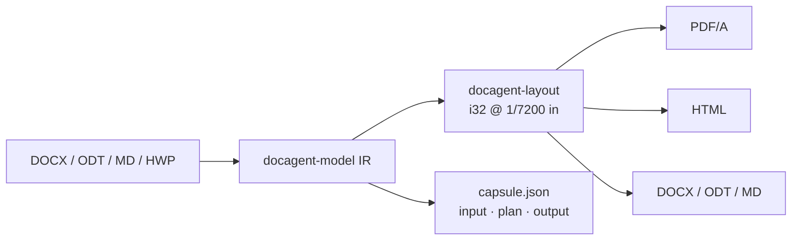

<p align="center">
  
</p>

<p align="center">
  <a href="https://github.com/kevin9327/docagent/actions/workflows/ci.yml"></a>
  
  
  
  
  
</p>

<p align="center"><b>The document runtime agents actually run.</b><br>
DOCX · ODT · Markdown · HTML · PDF/A — one engine, three hashes, same bytes twice.<br>
Hangul HWP / HWPX / HML are regional codecs on the same IR. There is no GUI.</p>

<p align="center">
  <a href="#install--run">Install</a> ·
  <a href="#what-you-get">What you get</a> ·
  <a href="#why-this-beats-the-field">Why this beats the field</a> ·
  <a href="#command--query--event">API</a> ·
  <a href="docs/src/intro.md">Docs</a>
</p>

---

<p align="center">
  
</p>

<p align="center">
  
</p>
<p align="center"><sub>Actual engine output of <code>examples/letter.md</code> — PDF/A page, HTML, capsule hashes. Not mockups.</sub></p>

## Why this exists

MinerU, Docling, Marker, and Unstructured turn documents into tokens for models.
Pandoc, python-docx, WeasyPrint, and LibreOffice turn documents into other documents.
**DocAgent is the runtime in the middle that an agent can call, replay, and prove.**

| An agent needs | DocAgent |
| --- | --- |
| One typed call, not a GUI | `Command::Convert` |
| Proof it ran the same file | capsule: input / plan / output SHA-256 |
| Same fonts → same PDF twice | integer layout at 1/7200 inch |
| Word, LibreOffice, Markdown, print | DOCX · ODT · MD · HTML · PDF/A |
| Korean public files without a second product | HWP · HWPX · HML on the same IR |
| No GPU bill, no VLM drift | CPU, deterministic |

People still receive a normal file. The agent receives a capsule.

## Install / run

```bash
git clone https://github.com/kevin9327/docagent
cd docagent
cargo test --workspace
cargo run -p docagent-cli -- convert examples/letter.md \
  --pdf out.pdf --html out.html --odt out.odt --docx out.docx --capsule cap.json
cargo run -p docagent-cli -- prove examples/letter.md
```

`prove` converts twice (PDF/A + HTML) and exits 0 only when the bytes and the three SHA-256 hashes match. Fixture: [`docs/assets/letter-prove.json`](docs/assets/letter-prove.json).

Binaries: `docagent` (CLI) · `docagentd` (daemon) · MCP + WIT adapters.

```rust
use docagent_api::{Command, Engine, ExportTarget};

let mut engine = Engine::new();
let out = engine.execute(Command::Convert {
    input: std::fs::read("examples/letter.md")?,
    input_kind: None,
    targets: vec![ExportTarget::PdfA, ExportTarget::Html, ExportTarget::Markdown],
})?;
// out.capsule.{input_hash, plan_hash, output_hash}
```

## Same bytes twice

Not a slogan. Two `Command::Convert` calls on [`examples/letter.md`](examples/letter.md) (PDF/A + HTML) produced the same files. The test is `letter_md_is_byte_identical_across_two_runs`.

<p align="center">
  
</p>
<p align="center"><sub>Run 1 and run 2. <code>identical: true</code>. PDF bytes equal. HTML bytes equal.</sub></p>

| Hash | SHA-256 (both runs) |
| --- | --- |
| input | `b513b323320b4aad7f3cf8917a5b844c639bfb38c210417abee0aaa85d29e895` |
| plan | `928b47459b089d2dc7e60d6f764b798aaaa955a92ba6977ea6c157e7d88eea63` |
| output | `68bbe5cf9203b719580cf0a2cc719486b69bfd21a2d045cdf73606638d97798d` |

These are the hashes in [`letter-capsule.json`](docs/assets/letter-capsule.json). MinerU and Docling do not ship this. We do not ship OmniDocBench numbers.

## What you get

These three pictures are the convert of [`examples/letter.md`](examples/letter.md). Click through to the files: [PDF/A](docs/assets/letter.pdf) (`/Link` URI + strike fill + quote bar) · [HTML](docs/assets/letter.html) (`<a href>` / `<s>` / `<blockquote>`) · [DOCX](docs/assets/letter.docx) (`Heading1` / `Quote` / `w:numPr` / `w:hyperlink` / `w:strike`) · [ODT](docs/assets/letter.odt) (`text:h` / `text:list` / `text:a` / `Quote` / `text-line-through`) · [Markdown](docs/assets/letter.md) (GFM `| --- |` / `[text](url)` / `~~strike~~` / `> quote`) · [capsule JSON](docs/assets/letter-capsule.json).

```markdown
| **Hop** | **File** | **Proof** |
| --- | --- | --- |
| Input | letter.md | input SHA-256 |
| Plan | layout i32 @ 1/7200 in | plan SHA-256 |
| Output | PDF/A · HTML · ODT | output SHA-256 |
```

<p align="center">
  
</p>
<p align="center"><sub>PDF/A from the integer layout engine. Heading rules, list markers, hyperlink underlines, strikethrough, and quote bars are painted fills, not glyphs. Links are URI <code>/Link</code> annotations (click the last line). Bold is a second fill; italic is a 0.20 shear on the Regular face (GPU-free, <em>byte-for-byte</em>). Same fonts → same bytes on the next run.</sub></p>

<p align="center">
  
</p>
<p align="center"><sub>HTML from the same IR. Headings, quotes, tables with <strong>header</strong> cells, nested lists, <strong>bold</strong>, <em>italic</em>, <s>strikethrough</s>, and <a href="https://github.com/kevin9327/docagent">links</a>.</sub></p>

<p align="center">
  
</p>
<p align="center"><sub>Capsule from that convert: input / plan / output SHA-256. Replay is evidence.</sub></p>

<p align="center">
  
</p>
<p align="center"><sub>Paper in → PDF/A + HTML out. The metal token is the capsule: three SHA-256 hashes an agent can replay.</sub></p>

<p align="center">
  
</p>
<p align="center"><sub>One layout pass. Input, plan, and output each get a hash. Same fonts, same bytes.</sub></p>

| Surface | What it is |
| --- | --- |
| **IR** | Format-blind document model. Layout never sees “docx” or “hwp”. |
| **Layout** | One engine. Coordinates are `i32` at 1/7200 inch. `f32` is forbidden. |
| **PDF/A** | Archival print. Heading rules, list markers, hyperlink underlines, strikethrough, quote bars, and table fills are `FillRect`s. Links are URI `/Link` annotations. Two runs, same fonts, same bytes. |
| **DOCX / ODT** | Headings as `w:pStyle Heading1/2` + `text:h` with `fo:font-size` 18pt/14pt. Quotes as `w:pStyle Quote` + `text:p` Quote with a left border. Lists as `w:numPr` and `text:list`. Links as `w:hyperlink` and `text:a`. Runs keep `w:b`/`w:i`/`w:strike` and `text-line-through` in body and table cells. |
| **Markdown** | Pipe tables write a GFM separator after the header. Cells keep `**bold**` / `_italic_`. Links write `[text](url)`. Strikethrough writes `~~text~~`. Quotes write `> text`. |
| **HTML** | Semantic HTML an agent can read back. Quotes are `<blockquote>`. Table cells keep `<strong>`/`<em>`. Links are `<a href>`. Strikethrough is `<s>`. |
| **Capsule** | Three SHA-256 hashes on every Command so a retry is evidence, not hope. |
| **Hangul** | HWP 5 / HWPX / HWP 3 / HML as codecs, not as the product name. |

No spreadsheet. No slides. No cursor. No undo stack. Flow documents only.

## Why this beats the field

Locked against the ten most-starred document repositories an agent actually meets
(star counts 2026-09-06). This is the **agent-runtime** matrix, not an OCR bake-off.
DocAgent does not claim MinerU's VLM scores. MinerU does not ship a replayable capsule.

| Axis | **DocAgent** | [MinerU](https://github.com/opendatalab/MinerU) | [Docling](https://github.com/docling-project/docling) | [Pandoc](https://github.com/jgm/pandoc) | [Marker](https://github.com/datalab-to/marker) | [Unstructured](https://github.com/Unstructured-IO/unstructured) | [PyMuPDF](https://github.com/pymupdf/PyMuPDF) | [WeasyPrint](https://github.com/Kozea/WeasyPrint) | [python-docx](https://github.com/python-openxml/python-docx) | [LibreOffice](https://github.com/LibreOffice/core) |
| --- | :---: | :---: | :---: | :---: | :---: | :---: | :---: | :---: | :---: | :---: |
| Stars (context) | — | 79k | 66k | 46k | 40k | 15k | 11k | 10k | 5.7k | 4.3k |
| Typed Command / Query / Event | **yes** | | | | | | | | | |
| Capsule SHA-256 ×3 | **yes** | | | | | | | | | |
| Byte-identical rerun | **yes** | | | | | | | | | |
| Integer layout (1/7200") | **yes** | | | | | | | | | |
| GPU-free convert | **yes** | | optional | **yes** | | | **yes** | **yes** | **yes** | **yes** |
| Native DOCX | **yes** | **yes** | **yes** | **yes** | | **yes** | | | **yes** | **yes** |
| Native ODT | **yes** | | **yes** | **yes** | | | | | | **yes** |
| Markdown in/out | **yes** | out | out | **yes** | out | out | | | | |
| PDF/A out | **yes** | | | via TeX | | | | PDF | | PDF |
| HWP / HWPX / HML | **yes** | | | | | | | | | |
| No GUI in the product | **yes** | | | **yes** | | **yes** | **yes** | **yes** | **yes** | |
| VLM / OCR (not our job) | | **yes** | **yes** | | **yes** | **yes** | | | | |

**North star:** an agent drops `examples/letter.md` (or DOCX/ODT) and gets PDF/A + HTML + Markdown + DOCX + ODT whose
bytes match the next run, with three hashes in the capsule. Heading 1/2, quotes, hyperlinks, and strikethrough survive the Word and LibreOffice files.
That is the merge gate.
Hangul LineSeg vs rhwp is a regional CI track, not this page.

## Command / Query / Event

```text
Command  →  Convert | Import | Export | LayoutDocument
Query    →  EngineVersion | LastCapsule | LastDocument | CapsuleByInputHash
Event    →  CommandCompleted { capsule_id } | Warning
```

Every Command writes a capsule. CLI, daemon, MCP, and WIT are thin adapters over
the same `Engine`. See [`AGENTS.md`](AGENTS.md) and [`docs/src/intro.md`](docs/src/intro.md).



## Crate graph

Codecs (`docx`, `odt`, `md`, `hwp5`, `hwpx`, `hwp3`, `hml`) do not import each other
and do not import layout. Layout, paint, raster, and PDF do not know the source format.

```
cargo test --workspace
cargo clippy --workspace --all-targets -- -D warnings
cargo run -p docagent-lint
cargo run -p docagent-conformance -- --require-win
```

## Docs

- [Intro](docs/src/intro.md)
- [Format hops](docs/src/format-hops.md)
- [ADRs](docs/src/adr/README.md) — crate boundaries, integer layout, single engine, capsules

## License

MIT. See [LICENSE](LICENSE).
