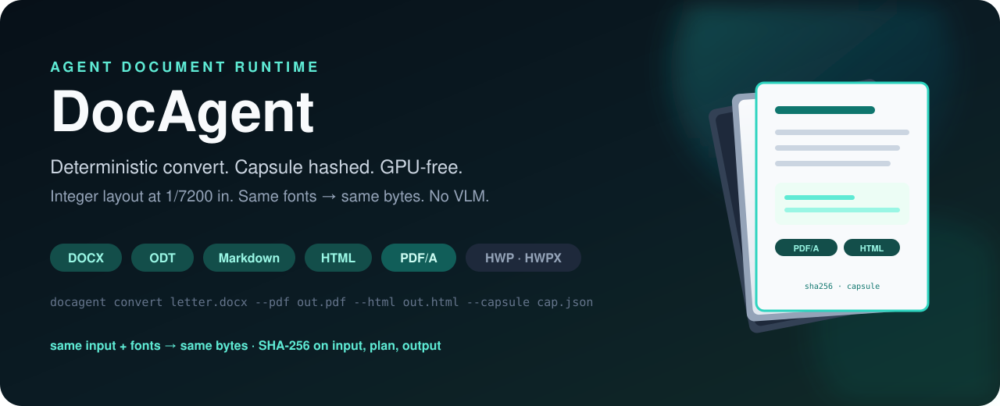
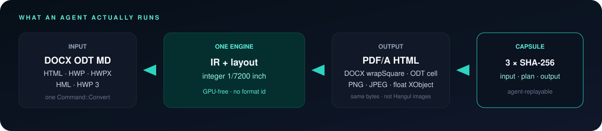
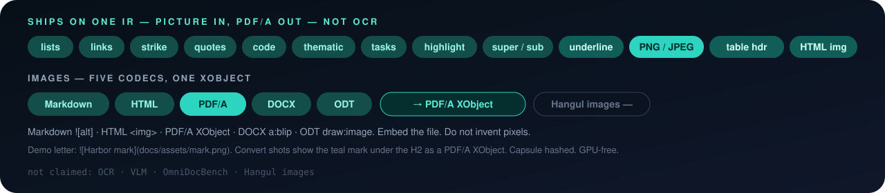
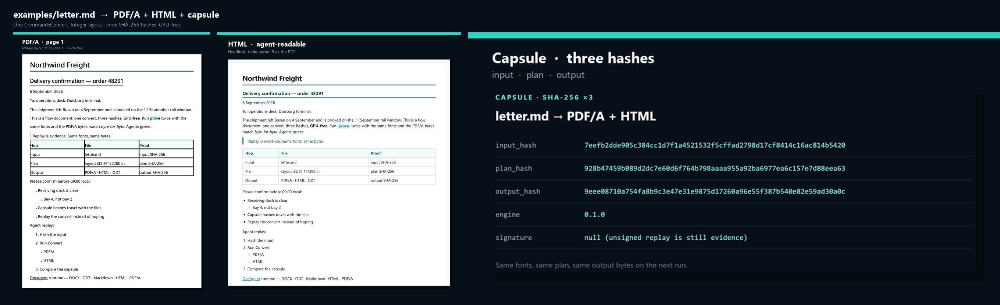
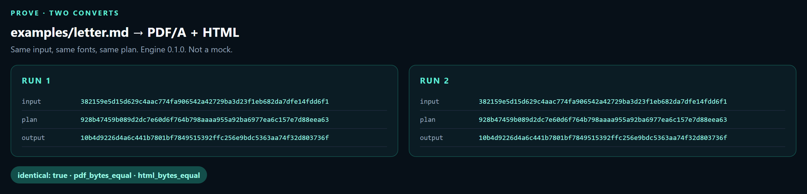
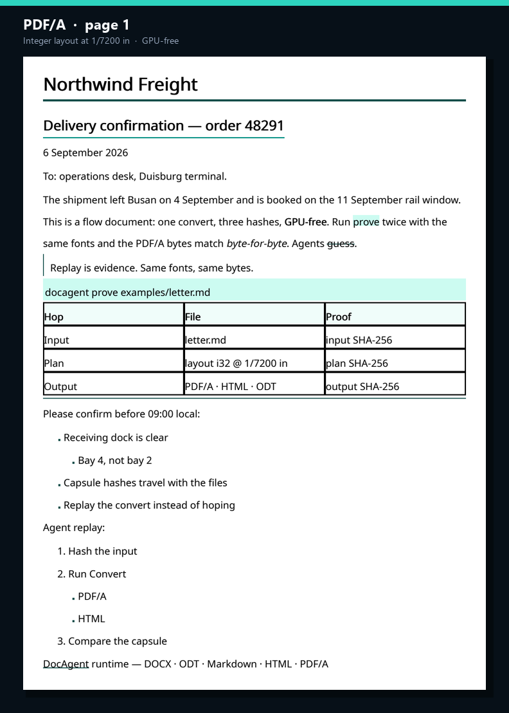
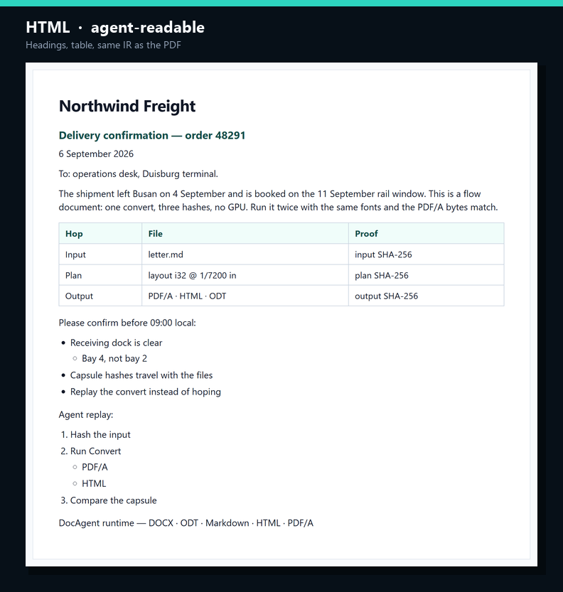
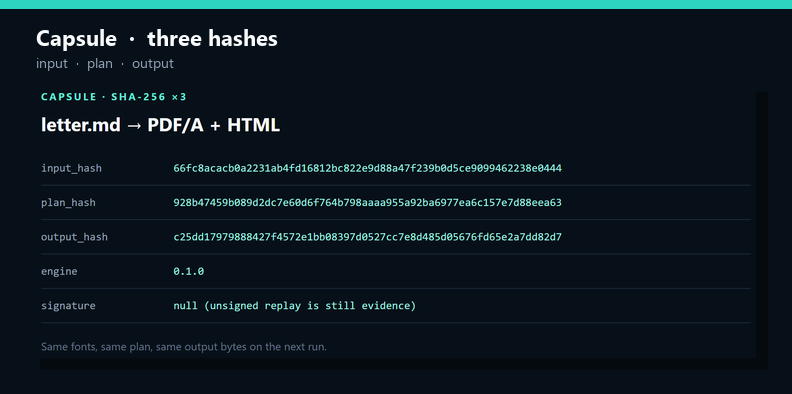
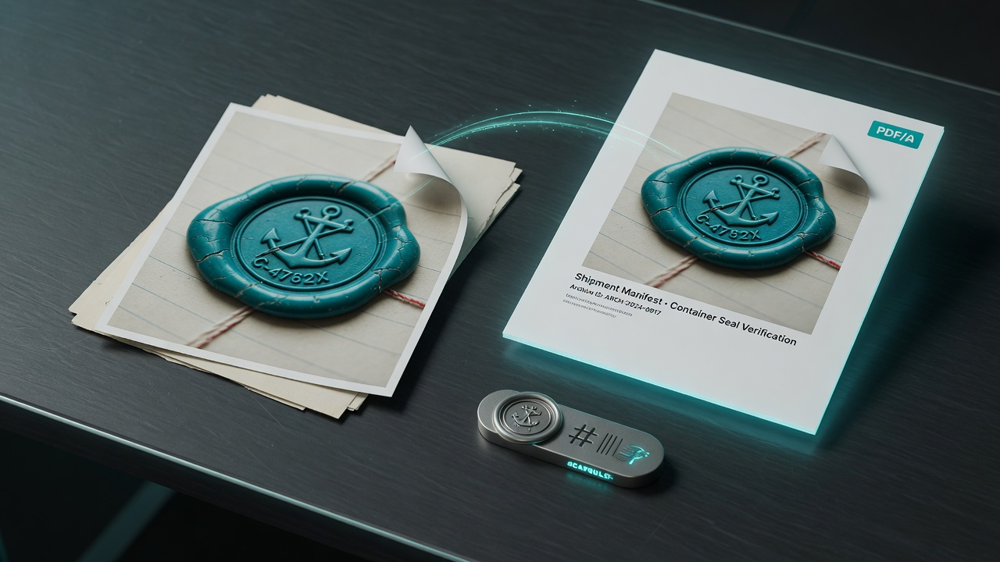

<p align="center">
  
</p>

<p align="center">
  <a href="https://github.com/kevin9327/docagent/actions/workflows/ci.yml"></a>
  
  
  
  
  
</p>

<p align="center"><b>Deterministic convert. Three-hash capsule. GPU-free.</b><br>
Same fonts → same PDF/A bytes. One integer engine. Agents call <code>Command::Convert</code>, not a GUI.<br>
DOCX · ODT · Markdown · HTML · PDF/A — PNG + JPEG (PDF float, DOCX wrapSquare, ODT cell). Hangul is a codec, not the product name.</p>

<p align="center">
  <a href="#install--run">Install</a> ·
  <a href="#vs-the-locked-ten">vs the field</a> ·
  <a href="#what-ships">What ships</a> ·
  <a href="#command--query--event">API</a> ·
  <a href="docs/src/intro.md">Docs</a>
</p>

---

<p align="center">
  
</p>

<p align="center">
  
</p>

<p align="center">
  
</p>
<p align="center"><sub>Actual engine output of <code>examples/letter.md</code> — PDF/A, HTML, capsule. Not mockups. This fixture has no image.<br>
PNG + JPEG on MD / HTML / PDF/A (float XObject, cell images) / DOCX (<code>wrapSquare</code>, <code>behindDoc</code>) / ODT (cell <code>draw:image</code>, nested lists). HTML <code>read</code> of <code>&lt;img data:…&gt;</code>, lists, <code>&lt;blockquote&gt;</code>, <code>&lt;pre&gt;</code>, <code>&lt;a href&gt;</code>, <code>&lt;mark&gt;</code> — not HTML5. Hangul Quote / CodeBlock / HorizontalLine / Task / CHAR_SHAPE highlight / table headers (not HWP 3). Not Hangul images or first-class lists.</sub></p>

## Why this exists

MinerU, Docling, Marker, and Unstructured turn documents into tokens for models.
Pandoc, python-docx, WeasyPrint, ONLYOFFICE, and LibreOffice turn documents into other documents.
**DocAgent is the runtime in the middle that an agent can call, replay, and prove.**

| An agent needs | DocAgent |
| --- | --- |
| One typed call, not a GUI | `Command::Convert` |
| Proof it ran the same file | capsule: input / plan / output SHA-256 |
| Same fonts → same PDF twice | integer layout at 1/7200 inch |
| Word, LibreOffice, Markdown, print | DOCX · ODT · MD · HTML · PDF/A |
| Images on those five codecs | PNG + JPEG: `![alt]`, ``, PDF/A float XObject, DOCX `wp:wrapSquare`, ODT cell `draw:image` |
| HTML an agent can import | `read` recovers data-URI ``, `<blockquote>`, `<pre>`, `<a href>`, `<mark>` — not HTML5 |
| Korean public files without a second product | HWP · HWPX · HML · HWP 3 on the same IR |
| No GPU bill, no VLM drift | CPU, deterministic |

People still receive a normal file. The agent receives a capsule.

## vs the locked ten

Locked against the ten most-starred document repositories an agent actually meets
(star counts 2026-09-06). This is the **agent-runtime** matrix, not an OCR bake-off.
DocAgent does not claim MinerU's VLM scores. MinerU does not ship a replayable capsule.
No OmniDocBench numbers live on this page.

| Tool | Job | C/Q/E | Capsule | Same bytes | i32 layout | GPU-free | Hangul |
| --- | --- | :---: | :---: | :---: | :---: | :---: | :---: |
| **DocAgent** | Agent document runtime | **yes** | **SHA-256 ×3** | **yes** | **1/7200"** | **yes** | **yes** |
| [MinerU](https://github.com/opendatalab/MinerU) 79k | PDF/Office → LLM markdown | | | | | | |
| [Docling](https://github.com/docling-project/docling) 66k | Gen-AI parse + export | | | | | optional | |
| [Pandoc](https://github.com/jgm/pandoc) 46k | Universal markup convert | | | | | **yes** | |
| [Marker](https://github.com/datalab-to/marker) 40k | PDF → markdown/JSON | | | | | | |
| [Unstructured](https://github.com/Unstructured-IO/unstructured) 15k | Document ETL for LLMs | | | | | | |
| [PyMuPDF](https://github.com/pymupdf/PyMuPDF) 11k | PDF extract/convert | | | | | **yes** | |
| [WeasyPrint](https://github.com/Kozea/WeasyPrint) 10k | HTML/CSS → PDF | | | | | **yes** | |
| [ONLYOFFICE](https://github.com/ONLYOFFICE/DocumentServer) 6.9k | Collaborative office suite | | | | | **yes** | |
| [python-docx](https://github.com/python-openxml/python-docx) 5.7k | Word DOCX read/write | | | | | **yes** | |
| [LibreOffice](https://github.com/LibreOffice/core) 4.3k | Headless office convert | | | | | **yes** | |

**North star:** drop `examples/letter.md` (or DOCX/ODT) and get PDF/A + HTML + Markdown + DOCX + ODT whose bytes match the next run, with three hashes in the capsule.
Images: **yes** PNG + JPEG on Markdown / HTML / PDF/A / DOCX / ODT — PDF float XObject, DOCX `wp:wrapSquare`, ODT cell `draw:image`. **—** on Hangul. `letter.md` itself still has no image.
HTML: `read` recovers ``, `<blockquote>`, `<pre>`, `<a href>`, `<mark>` (Pandoc-class import). Not a full HTML5 engine.
Hangul CHAR_SHAPE (incl. shade highlight), hyperlinks, Quote / CodeBlock / HorizontalLine / Task: **yes** on HWP 5 + HWPX + HML + HWP 3.
Hangul LineSeg vs rhwp is a regional CI track, not this page.

## What ships

Honest codec coverage — not a wishlist. Full table: [`docs/src/capabilities.md`](docs/src/capabilities.md).

| Mark | Markdown | HTML | PDF/A | DOCX | ODT | Hangul |
| --- | :---: | :---: | :---: | :---: | :---: | :---: |
| Lists (ul/ol, nested) | **yes** | **yes** | markers | `w:numPr` | `text:list` | — |
| Links | `[text](url)` | `<a href>` | URI `/Link` | `w:hyperlink` | `text:a` | `%hlk` / `HYPERLINK` / TagID 3 |
| Strike | `~~text~~` | `<s>` | fill | `w:strike` | line-through | CHAR_SHAPE (not HWP 3) |
| Quotes | `>` | `<blockquote>` | quote bar | Quote | Quote | **yes** · Quote style |
| Code | `` `span` `` / fence | `<code>` / `<pre>` | fills | Code / CodeBlock | Tcode / CodeBlock | **yes** · CodeBlock style |
| Thematic break | `---` | `<hr/>` | rule fill | HorizontalLine | HorizontalLine | **yes** · HorizontalLine |
| Tasks | `- [x]` | checkbox | task box | `[x]` | `[x]` | **yes** · Task style |
| Highlight | `==mark==` | `<mark>` | fill | `w:highlight` | Tmark | **yes** · CHAR_SHAPE shade |
| Super / sub | `^ ^` / `~ ~` | `<sup>` / `<sub>` | baseline | `w:vertAlign` | Tsuper / Tsub | CHAR_SHAPE |
| Underline | `__text__` | `<u>` | fill | `w:u` | Tunder | CHAR_SHAPE |
| Images (PNG, JPEG) | `` | `` | XObject · float | `a:blip` · wrapSquare | `draw:image` · cell | — |
| Table header | GFM `\| --- \|` | `<th>` | header fill | `w:tblHeader` | `THcell` | **yes** · not HWP 3 |

Hangul CHAR_SHAPE maps bold / italic / underline / super / sub on HWP 5, HWPX `hh:charPr`, HML `CHARSHAPE`, and HWP 3 attr bits (HWP 3 has no strike bit). Highlight is CHAR_SHAPE shade (HWP 5 shade RGB, HWPX `hh:shade`, HML `SHADECOLOR`, HWP 3 shade ratio). Table header rows round-trip on HWP 5 / HWPX / HML (HWP 3 has no header primitive). Hyperlinks: HWP 5 `%hlk`, HWPX `hp:fieldBegin type="HYPERLINK"`, HML `FIELDBEGIN Type="Hyperlink"`, HWP 3 control-10 + additional-info TagID 3. Para styles `Quote`, `CodeBlock`, `HorizontalLine`, and `Task` (`[x]` / `[ ]`) round-trip on all four Hangul codecs. Images and first-class lists do not.

HTML `read` recovers ``, `<ul>`/`<ol>`/`<ul class="tasks">`, `<blockquote>`, `<pre>`, `<a href>`, and `<mark>` into the same IR (Pandoc-class import). Write emits those tags. `http(s):` `src` is skipped. This is not a full HTML5 engine: no CSS layout, no JavaScript, no remote fetch. `examples/letter.md` has no image, so the convert shots below do not show one.

PDF `Block::Float(Float::Image)` and table-cell images layout and paint as PDF/A XObjects; oversized images clamp to content width. DOCX `WrapMode::Square` / `Behind` round-trip as `wp:wrapSquare` / `wp:wrapNone`+behindDoc. ODT writes `draw:image` inside table cells and nested `<text:list>` inside `<text:list-item>`.

No spreadsheet. No slides. No cursor. No undo stack. Flow documents only.

## Install / run

```bash
git clone https://github.com/kevin9327/docagent
cd docagent
cargo test --workspace
cargo run -p docagent-cli -- convert examples/letter.md \
  --pdf out.pdf --html out.html --odt out.odt --docx out.docx --capsule cap.json
cargo run -p docagent-cli -- prove examples/letter.md
```

`prove` converts twice (PDF/A + HTML) and exits 0 only when the bytes and the three SHA-256 hashes match. Fixture: [`docs/assets/letter-prove.json`](docs/assets/letter-prove.json).

Binaries: `docagent` (CLI) · `docagentd` (daemon) · MCP + WIT adapters.

```rust
use docagent_api::{Command, Engine, ExportTarget};

let mut engine = Engine::new();
let out = engine.execute(Command::Convert {
    input: std::fs::read("examples/letter.md")?,
    input_kind: None,
    targets: vec![ExportTarget::PdfA, ExportTarget::Html, ExportTarget::Markdown],
})?;
// out.capsule.{input_hash, plan_hash, output_hash}
```

## Same bytes twice

Not a slogan. Two `Command::Convert` calls on [`examples/letter.md`](examples/letter.md) (PDF/A + HTML) produced the same files. The test is `letter_md_is_byte_identical_across_two_runs`.

<p align="center">
  
</p>
<p align="center"><sub>Run 1 and run 2. <code>identical: true</code>. PDF bytes equal. HTML bytes equal.</sub></p>

| Hash | SHA-256 (both runs) |
| --- | --- |
| input | `927baa86fcdc5d76a72cfbcc8ee32ac3cadbcefb2505bc4bb80b335a14ddef74` |
| plan | `928b47459b089d2dc7e60d6f764b798aaaa955a92ba6977ea6c157e7d88eea63` |
| output | `86f9fb0ea23d189dddd58705f2330e44312a6b557459d332f9bf188dfe505d92` |

These are the hashes in [`letter-capsule.json`](docs/assets/letter-capsule.json). MinerU and Docling do not ship this.

## Convert shots

Files from [`examples/letter.md`](examples/letter.md): [PDF/A](docs/assets/letter.pdf) · [HTML](docs/assets/letter.html) · [DOCX](docs/assets/letter.docx) · [ODT](docs/assets/letter.odt) · [Markdown](docs/assets/letter.md) · [capsule JSON](docs/assets/letter-capsule.json).

<p align="center">
  
</p>
<p align="center"><sub>PDF/A from the integer layout engine. List markers, task boxes, links, strike, quote bars, code fills, highlight, rules, and header cells are painted fills. Superscripts/subscripts shift the baseline. Bold is a second fill; italic is a 0.20 shear. PNG and JPEG, when present, are PDF/A XObjects — including <code>Block::Float</code> images. This letter fixture has none. GPU-free. Same fonts → same bytes.</sub></p>

<p align="center">
  
</p>
<p align="center"><sub>HTML from the same IR: headings, quotes, tables, nested lists, tasks, bold, italic, strike, code, fence, rule, highlight, underline, super/sub, and links. Write emits <code>&lt;img src="data:…"&gt;</code>, <code>&lt;blockquote&gt;</code>, <code>&lt;pre&gt;</code>, <code>&lt;a href&gt;</code>, <code>&lt;mark&gt;</code>; <code>read</code> recovers those tags. The letter fixture has no image. Not HTML5.</sub></p>

<p align="center">
  
</p>
<p align="center"><sub>Capsule: input / plan / output SHA-256. Replay is evidence.</sub></p>

<p align="center">
  
</p>
<p align="center"><sub>Paper in → PDF/A + HTML out. The metal token is the capsule: three SHA-256 hashes an agent can replay.</sub></p>

<p align="center">
  
</p>
<p align="center"><sub>One layout pass. Input, plan, and output each get a hash. Same fonts, same bytes.</sub></p>

| Surface | What it is |
| --- | --- |
| **IR** | Format-blind document model. Layout never sees “docx” or “hwp”. |
| **Layout** | One engine. Coordinates are `i32` at 1/7200 inch. `f32` is forbidden. |
| **PDF/A** | Archival print from the integer plan. PNG and JPEG are XObjects, including `Block::Float(Float::Image)`. Oversized floats clamp to content width. Two runs, same fonts, same bytes. |
| **DOCX / ODT** | Word and LibreOffice files. Headings, lists, links, strike, quotes, code, tasks, highlight, underline, super/sub, table headers, PNG + JPEG (`a:blip` / `draw:image`). DOCX `wrapSquare` / `behindDoc`. ODT nested lists + cell images + `svg:desc` alt. |
| **Markdown / HTML** | Agent-native text and semantic HTML. Markdown ``. HTML write emits ``, lists, `<blockquote>`, `<pre>`, `<a href>`, `<mark>`; `read` recovers those tags. Not HTML5. |
| **Capsule** | Three SHA-256 hashes on every Command so a retry is evidence, not hope. |
| **Hangul** | HWP 5 / HWPX / HWP 3 / HML as codecs, not as the product name. CHAR_SHAPE (including shade highlight), hyperlinks, Quote / CodeBlock / Task styles, HorizontalLine thematic breaks, and table headers (not HWP 3). Still **—**: images, first-class lists. |

## Command / Query / Event

```text
Command  →  Convert | Import | Export | LayoutDocument
Query    →  EngineVersion | LastCapsule | LastDocument | CapsuleByInputHash
Event    →  CommandCompleted { capsule_id } | Warning
```

Every Command writes a capsule. CLI, daemon, MCP, and WIT are thin adapters over
the same `Engine`. See [`AGENTS.md`](AGENTS.md) and [`docs/src/intro.md`](docs/src/intro.md).


## Crate graph

Codecs (`docx`, `odt`, `md`, `html`, `hwp5`, `hwpx`, `hwp3`, `hml`) do not import each other
and do not import layout. Layout, paint, raster, and PDF do not know the source format.

```
cargo test --workspace
cargo clippy --workspace --all-targets -- -D warnings
cargo run -p docagent-lint
cargo run -p docagent-conformance -- --require-win
```

## Docs

- [Intro](docs/src/intro.md)
- [What ships](docs/src/capabilities.md)
- [Format hops](docs/src/format-hops.md)
- [ADRs](docs/src/adr/README.md) — crate boundaries, integer layout, single engine, capsules

## License

MIT. See [LICENSE](LICENSE).
