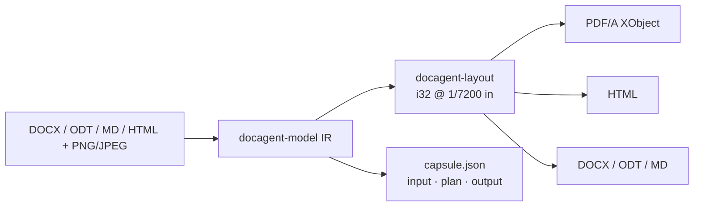

<p align="center">
  
</p>

<p align="center">
  <a href="https://github.com/kevin9327/docagent/actions/workflows/ci.yml"></a>
  <a href="https://github.com/kevin9327/docagent/stargazers"></a>
  
  
  
  
  
  
  
  
  
  
</p>

<p align="center"><b>Picture in. PDF/A out. Capsule hashed. GPU-free.</b>
<code>Command::Convert</code> · SHA-256 ×3 · i32 1/7200" · PNG/JPEG → PDF/A XObject · not OCR.
MinerU parses a scan. DocAgent embeds a PNG.</p>

<p align="center">
  <a href="#vs-the-locked-ten">vs the field</a> ·
  <a href="#quickstart">Quickstart</a> ·
  <a href="#what-ships">What ships</a> ·
  <a href="#command--query--event">API</a> ·
  <a href="docs/src/intro.md">Docs</a>
</p>

<details>
<summary><b>Unique vs the locked ten</b> — <code>Command/Query/Event</code> · capsule SHA-256 ×3 · <code>prove</code> same bytes. Not OCR. WeasyPrint tightness not claimed.</summary>

MinerU, Docling, Pandoc, Marker, Unstructured, PyMuPDF, WeasyPrint, ONLYOFFICE, python-docx, and LibreOffice do not ship an agent API, a three-hash capsule, and byte-identical replay together.

- **Picture in, PDF/A out.** PNG/JPEG on Markdown, HTML, DOCX, ODT paint as a PDF/A XObject. We embed the bytes. We do not OCR.
- **Integer layout.** Coordinates are <code>i32</code> at 1/7200 inch. Same fonts → same bytes. GPU-free.
- **Hangul** is a regional codec on the same IR (images <b>—</b>), not the product name.
- **Not claimed:** OCR, VLM, OmniDocBench, WeasyPrint print-CSS tightness (table/paragraph still <b>open</b>).

Hashes below are the SHA-256 ×3 in <a href="docs/assets/letter-capsule.json"><code>letter-capsule.json</code></a>.
</details>

<p align="center">
  
</p>
<p align="center"><sub><code>examples/letter.md</code> → PDF/A + HTML + capsule. Teal harbor mark under the H2. JSON <code>b468b37f…</code>; trio/capsule panel still <code>b867db0a…</code> (shots lag — not a fake hash). WeasyPrint tightness <b>not</b> claimed closed.</sub></p>

| Hash | SHA-256 ([`letter-capsule.json`](docs/assets/letter-capsule.json)) |
| --- | --- |
| input | `b0f4423728db4238779b3bf6cbd238d4d0d637f733c078322be6ff23398bbcdf` |
| plan | `4b7360eb1b7a9bec20cc35d5c79f2156c22d2712ab62ededfb60e328b8f16d3a` |
| output | `b468b37f1c3d8da7e4aac7e1a8417b46c29a57863817f9df16e8d4a6cc89f0f8` |

## vs the locked ten

Locked against the ten most-starred document repositories an agent actually meets
(star counts 2026-09-06). Agent-runtime matrix, not an OCR bake-off. No OmniDocBench numbers.

| Tool | Job | C/Q/E | Capsule | Same bytes | i32 layout | GPU-free | Hangul |
| --- | --- | :---: | :---: | :---: | :---: | :---: | :---: |
| **DocAgent** | Agent document runtime | **yes** | **SHA-256 ×3** | **yes** | **1/7200"** | **yes** | **yes** |
| [MinerU](https://github.com/opendatalab/MinerU) 79k | PDF/Office → LLM markdown | | | | | | |
| [Docling](https://github.com/docling-project/docling) 66k | Gen-AI parse + export | | | | | optional | |
| [Pandoc](https://github.com/jgm/pandoc) 46k | Universal markup convert | | | | | **yes** | |
| [Marker](https://github.com/datalab-to/marker) 40k | PDF → markdown/JSON | | | | | | |
| [Unstructured](https://github.com/Unstructured-IO/unstructured) 15k | Document ETL for LLMs | | | | | | |
| [PyMuPDF](https://github.com/pymupdf/PyMuPDF) 11k | PDF extract/convert | | | | | **yes** | |
| [WeasyPrint](https://github.com/Kozea/WeasyPrint) 10k | HTML/CSS → PDF | | | | | **yes** | |
| [ONLYOFFICE](https://github.com/ONLYOFFICE/DocumentServer) 6.9k | Collaborative office suite | | | | | **yes** | |
| [python-docx](https://github.com/python-openxml/python-docx) 5.7k | Word DOCX read/write | | | | | **yes** | |
| [LibreOffice](https://github.com/LibreOffice/core) 4.3k | Headless office convert | | | | | **yes** | |

**North star:** drop `examples/letter.md` (or DOCX/ODT) that contains a PNG or JPEG, and get PDF/A + HTML + Markdown + DOCX + ODT whose bytes match the next run, with three hashes in the capsule. The picture is a PDF/A XObject. Not OCR.

Images: **yes** PNG + JPEG on Markdown / HTML / PDF/A / DOCX / ODT. **—** on Hangul.
The demo letter is ``. First-screen convert shot above shows the teal mark under the H2. Demo-image gap **closed**. Print-CSS tightness vs WeasyPrint is **not** claimed closed.

## Quickstart

```bash
git clone https://github.com/kevin9327/docagent
cd docagent
cargo test --workspace
cargo run -p docagent-cli -- convert examples/letter.md \
  --pdf out.pdf --html out.html --odt out.odt --docx out.docx --capsule cap.json
cargo run -p docagent-cli -- prove examples/letter.md
```

`examples/letter.md` contains ``. Convert paints that teal mark under the H2 as a PDF/A XObject. `prove` converts twice (PDF/A + HTML) and exits 0 only when the bytes and the three SHA-256 hashes match. The prove JSON ([`letter-prove.json`](docs/assets/letter-prove.json)) is a separate artifact from the convert capsule in the table above — those plan/output hashes stay **distinct** (`928b4745…` / `2607bb6f…`). Do not copy them onto `letter-capsule.json`.

Binaries: `docagent` (CLI) · `docagentd` (daemon) · MCP + WIT adapters over the same `Engine`.

```rust
use docagent_api::{Command, Engine, ExportTarget};

let mut engine = Engine::new();
let out = engine.execute(Command::Convert {
    input: std::fs::read("examples/letter.md")?,
    input_kind: None,
    targets: vec![ExportTarget::PdfA, ExportTarget::Html, ExportTarget::Markdown],
})?;
// out.capsule.{input_hash, plan_hash, output_hash}
```

---

<p align="center">
  
</p>

<p align="center">
  
</p>

## Why this exists

MinerU, Docling, Marker, and Unstructured turn documents into tokens for models.
Pandoc, python-docx, WeasyPrint, ONLYOFFICE, and LibreOffice turn documents into other documents.
**DocAgent is the runtime in the middle that an agent can call, replay, and prove.**

## What ships

Honest codec coverage — not a wishlist. Full table: [`docs/src/capabilities.md`](docs/src/capabilities.md).

| Mark | Markdown | HTML | PDF/A | DOCX | ODT | Hangul |
| --- | :---: | :---: | :---: | :---: | :---: | :---: |
| Lists (ul/ol, nested) | **yes** | `read` ul/ol/tasks | markers | `w:numPr` | `text:list` | **yes** |
| Links | `[text](url)` | `<a href>` | URI `/Link` | `w:hyperlink` | `text:a` | **yes** |
| Strike | `~~text~~` | `<s>` | fill | `w:strike` | line-through | **yes** |
| Quotes | `>` | `<blockquote>` | quote bar | Quote | Quote | **yes** |
| Code | `` `span` `` / fence | `<code>` / `<pre>` | fills | Code | Tcode | **yes** |
| Thematic break | `---` | `<hr/>` | rule fill | HorizontalLine | HorizontalLine | **yes** |
| Tasks | `- [x]` | checkbox | task box | `[x]` | `[x]` | **yes** |
| Highlight | `==mark==` | `<mark>` | fill | `w:highlight` | Tmark | **yes** |
| Super / sub | `^ ^` / `~ ~` | `<sup>` / `<sub>` | baseline | `w:vertAlign` | Tsuper / Tsub | **yes** |
| Underline | `__text__` | `<u>` | fill | `w:u` | Tunder | **yes** |
| **Images (PNG, JPEG)** | `` | `` | **XObject** | `a:blip` | `draw:image` | **—** |
| Table header | GFM `\| --- \|` | `<th>` / `<thead>` | header fill | `w:tblHeader` | `THcell` | **yes** |

**Images are the first-class row.** PNG and JPEG round-trip on Markdown, HTML, PDF/A, DOCX, and ODT. They stay **—** on Hangul. That dash is real.

HTML `read` recovers data-URI ``, lists, `<th>`/`<thead>`, `<blockquote>`, `<pre>`, `<a href>`, and `<mark>` into the same IR. `http(s):` `src` is skipped. This is not a full HTML5 engine.

No spreadsheet. No slides. No cursor. No undo stack. No OCR. Flow documents only.

## Convert shots

Files from [`examples/letter.md`](examples/letter.md): [PDF/A](docs/assets/letter.pdf) · [HTML](docs/assets/letter.html) · [DOCX](docs/assets/letter.docx) · [ODT](docs/assets/letter.odt) · [Markdown](docs/assets/letter.md) · [capsule JSON](docs/assets/letter-capsule.json).

<p align="center">
  
</p>

```markdown

```

<table>
<tr>
<td width="50%" valign="top">
<p align="center">
  
</p>
<p align="center"><sub>PDF/A from the integer layout engine. Teal harbor mark under <em>Delivery confirmation — order 48291</em>. GPU-free. Same fonts → same bytes.</sub></p>
</td>
<td width="50%" valign="top">
<p align="center">
  
</p>
<p align="center"><sub>HTML from the same IR. Teal harbor mark under the H2 as <code>&lt;img&gt;</code>. <code>read</code> recovers data-URI images. Not HTML5. GPU-free.</sub></p>
</td>
</tr>
</table>

<p align="center">
  
</p>
<p align="center"><sub>Capsule from <code>examples/letter.md</code>: input / plan / output SHA-256. JSON <code>b468b37f…</code>; shot still shows <code>b867db0a…</code> (shots lag — not a fake hash). Two converts, same fonts, same bytes. GPU-free. Deterministic. Not OCR.</sub></p>

The test is `letter_md_is_byte_identical_across_two_runs`. Hashes above are the hashes in [`letter-capsule.json`](docs/assets/letter-capsule.json).

| Surface | What it is |
| --- | --- |
| **IR** | Format-blind document model. Layout never sees “docx” or “hwp”. |
| **Layout** | One engine. Coordinates are `i32` at 1/7200 inch. `f32` is forbidden. |
| **PDF/A** | Archival print from the integer plan. PNG and JPEG are XObjects. Two runs, same fonts, same bytes. |
| **DOCX / ODT** | Word and LibreOffice files. Headings, lists, links, tables, PNG + JPEG (`a:blip` / `draw:image`). |
| **Markdown / HTML** | Agent-native text and semantic HTML. ``. HTML `` write / data-URI `read`. Not HTML5. |
| **Capsule** | Three SHA-256 hashes on every Command so a retry is evidence, not hope. |
| **Hangul** | Regional codecs on the same IR, not the product name. Images on Hangul are still **—**. |

## Command / Query / Event

```text
Command  →  Convert | Import | Export | LayoutDocument
Query    →  EngineVersion | LastCapsule | LastDocument | CapsuleByInputHash
Event    →  CommandCompleted { capsule_id } | Warning
```

Every Command writes a capsule. CLI, daemon, MCP, and WIT are thin adapters over
the same `Engine`. See [`AGENTS.md`](AGENTS.md) and [`docs/src/intro.md`](docs/src/intro.md).



## Crate graph

Codecs (`docx`, `odt`, `md`, `html`, `hwp5`, `hwpx`, `hwp3`, `hml`) do not import each other
and do not import layout. Layout, paint, raster, and PDF do not know the source format.

```
cargo test --workspace
cargo clippy --workspace --all-targets -- -D warnings
cargo run -p docagent-lint
cargo run -p docagent-conformance -- --require-win
```

## Docs

- [Intro](docs/src/intro.md)
- [What ships](docs/src/capabilities.md)
- [Format hops](docs/src/format-hops.md)
- [ADRs](docs/src/adr/README.md) — crate boundaries, integer layout, single engine, capsules

## License

MIT. See [LICENSE](LICENSE).
